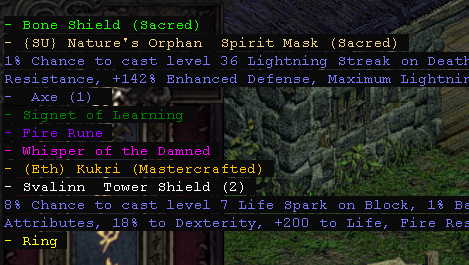

# D2Stats

## Features
- Read character/mercenary stats
- Check difference in stats between 2 states (Click 'Read' and after modifying stats click 'Diff' which display table of changed stats)
- Set up rule list that check drops and notify the user when matching one drops
- Play sound notification when goblin appears

[Forum post](https://forum.median-xl.com/viewtopic.php?f=4&t=85654)

## FAQ
### "Windows defender/Antivirus removes/quarantines the exe file. Is it a virus?"
This tool attaches itself to the `Game.exe` process and modifies memory to function properly. Due to this behaviour (and also frequent updates and small user pool) antivirus software label it as trojan. There is nothing i can do to fix it and i can only recommend to add .exe file to ignore/exception list.

### "Why can't i hide items using D2Stats?"
Mod version 2.10 introduced in-game loot filtering system that disabled filtering using D2Stats. Current version only allows for notifying when certain item drops. All filters that still have `hide` and `show` keywords need to have them removed for notifier to function properly

### "Why does the notifier overlay look so ugly. Can i modify it eg change font style or background transparency/color?"
Not really. The current implementation is very unstable so i've decided on monospaced font (Courier New) that is guaranteed to be on every machine. The current version only allows for changing those properties:
  - Font size
  - X and Y offset (in pixels) from top-left edge of the window
  - Notification timeout duration (in milisecond)
If you really want to change some properties that were not exposed on the application UI you'll have to edit the main script code itself (`D2Stats.au3`) and recompile it using provided script (`Compile.bat`)
